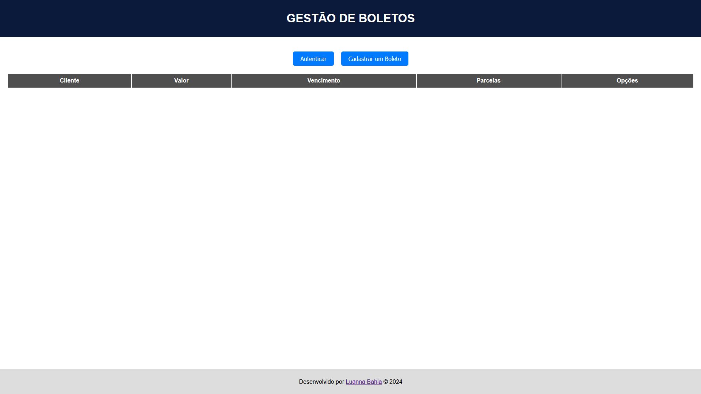
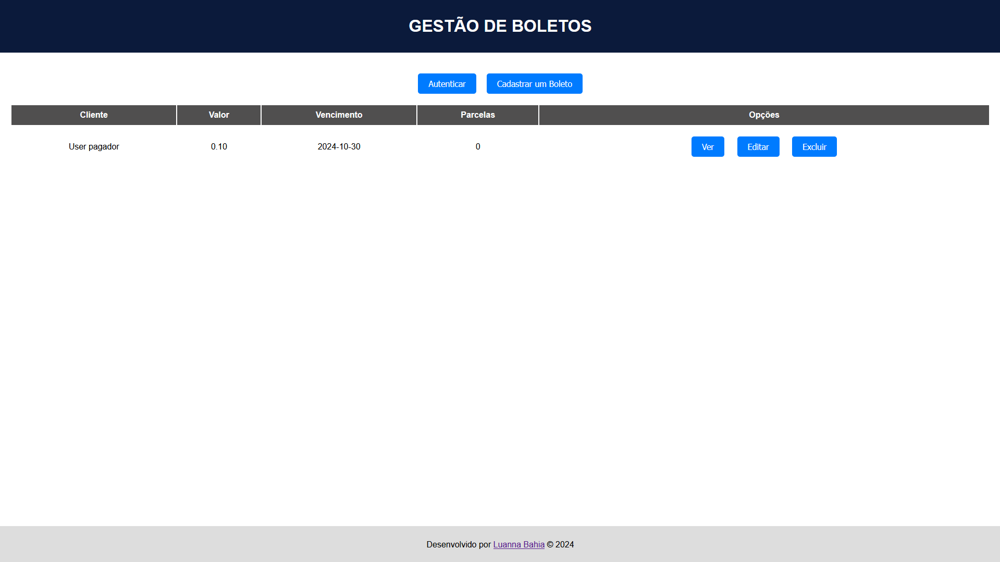

# Gestão de Boletos

## Descrição
Este é um projeto de **Gestão de Boletos** desenvolvido para facilitar o cadastro, edição e autenticação de boletos bancários usando a **API do Sicredi**. A aplicação permite autenticação de usuários e registro de novos boletos com informações detalhadas.

## Funcionalidades
- **Autenticação**: Autenticação do usuário através da API do Sicredi para obter um token de acesso.
- **Cadastro de Boletos**: Cadastro de boletos com informações detalhadas sobre o pagador e o valor.
- **Edição de Boletos**: Possibilidade de alterar a data de vencimento de boletos já registrados.

## Tecnologias Utilizadas
- **Postman**
- **HTML**
- **CSS**
- **JavaScript**
- **jQuery**
- **API Sicredi (Cobranca)**

## Como Utilizar

### Pré-requisitos
Antes de rodar o projeto, você precisa configurar as dependências necessárias para realizar as requisições à API Sicredi:
1. **Chave API** (x-api-key) da API do Sicredi.
2. **Autenticação** com as credenciais corretas para obter o token.
3. **Documentação*** é possível achar na internet, lá você vai encontrar os passos completos para implementar a api

### Instalação
1. Faça o download do repositório:
    ```bash
    git clone https://github.com/seu-usuario/gestao-de-boletos.git
    cd gestao-de-boletos
    ```

2. Abra o arquivo `index.html` no navegador.

### Uso
1. Clique no botão "Autenticar" para obter o token de acesso.
2. Clique no botão "Cadastrar um Boleto" para adicionar um novo boleto, preenchendo as informações necessárias.
3. Os boletos serão registrados via API, e são listados na interface.

## Interface

### Tela Principal
A interface principal é simples e eficiente, com um cabeçalho e botões principais para **Autenticar** e **Cadastrar Boleto**.

#### Tela Inicial:



### Interações e Mensagens de Sucesso/Erro
O sistema exibe mensagens de sucesso e erro conforme as ações são realizadas, tornando o fluxo intuitivo para o usuário.

## Estrutura do Projeto
```plaintext
gestao-de-boletos/
│
├── public/
│   ├── index.html                 # Interface principal e código JavaScript
│   ├── script.js                  # Arquivo onde contém a parte lógica e interação do usuário com a página web
│   ├── style.css                  # Arquivo que contém os estilos da página
│   ├── LICENSE                    # Projeto está sob licença
│   ├── README.md                  # Documento explicativo do projeto 

